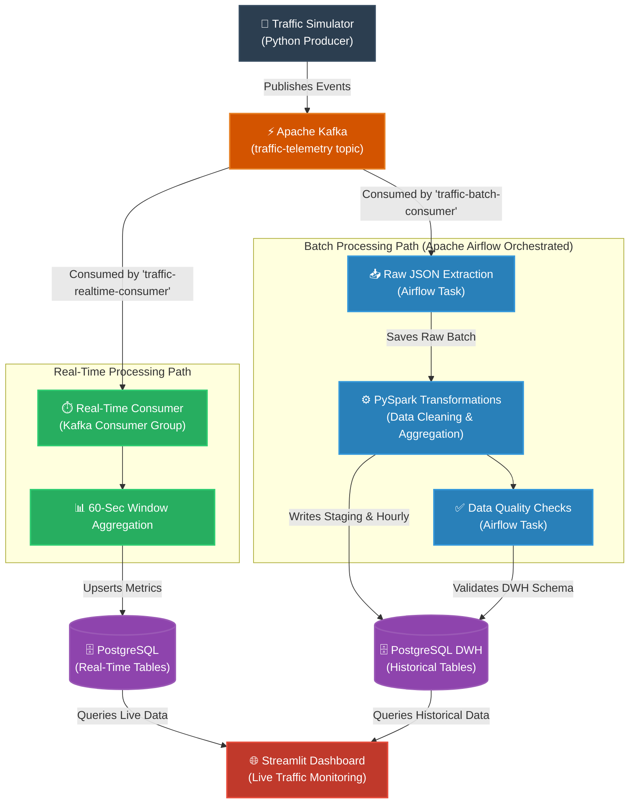

# 🚦 Real-Time & Batch Hybrid Traffic Monitoring Pipeline

A containerized hybrid data engineering platform for ingesting, processing, validating, and analyzing simulated traffic telemetry.

The platform demonstrates two independent processing paths built around a shared **Apache Kafka** event stream:
- **Real-Time Path** for low-latency traffic monitoring and alerts.
- **Batch Path** for scheduled historical processing, data quality checks, and analytics.

---

## 🏗️ Architecture



---

## 🛠️ Technology Stack
- **Languages:** Python 3.10+
- **Message Broker:** Apache Kafka, Apache ZooKeeper
- **Orchestration:** Apache Airflow 2.8.1 (LocalExecutor)
- **Data Processing:** PySpark 3.5.1
- **Database / Data Warehouse:** PostgreSQL 15
- **Frontend / Visualization:** Streamlit
- **Infrastructure:** Docker & Docker Compose

## 🚀 Getting Started

### 1. Prerequisites
- Docker Desktop
- Python 3.10+ (for local simulator)

### 2. Environment Setup
```bash
# Clone the repository
git clone https://github.com/yossefabdelkarem9/traffic-monitoring-pipeline.git
cd traffic-monitoring-pipeline

# Configure environment variables
cp .env.example .env
```

### 3. Start the Infrastructure
```bash
# Build and start all services
docker compose up -d --build
```
> **Note:** The initial setup may take a few minutes as it provisions PostgreSQL databases, runs Airflow migrations, and creates the admin user.

### 4. Start the Traffic Simulator
In a separate terminal, run the simulator to start generating live traffic data:
```bash
pip install -r simulator/requirements.txt
python simulator/traffic_producer.py
```

### 5. Access the Interfaces
- **Streamlit Live Dashboard:** `http://localhost:8501`
- **Airflow Web UI:** `http://localhost:8080` *(Login: admin / admin)*

---

## 🧩 Reliability & Design Choices

1. **Independent Consumer Groups:** The real-time and batch pipelines consume from the exact same Kafka topic (`traffic-telemetry`) but use completely isolated consumer groups.
2. **Idempotency:** 
   - Real-time events use `event_id` as a Primary Key in Postgres to silently drop duplicates.
   - Batch pipelines use Airflow's `DAG_RUN_ID` as a `batch_id` to safely allow pipeline retries without creating duplicated historical aggregations.
3. **Automated Data Quality:** The pipeline features integrated Data Quality (DQ) checks that act as a circuit breaker. If validation (e.g., speed limit anomalies, NULL values) fails, the Airflow task fails.

---
*Created by [Yossef Ahmed](https://www.linkedin.com/in/yossef-ahmed/)*
